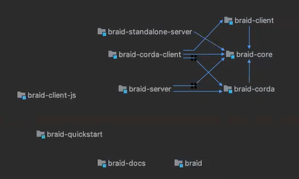

# Implementation

This is a top-level introduction to the implementation architecture.

- [Variations](#variations)
- [Modules](#modules)
- [Inter-module dependencies](#inter-module-dependencies)
- [External dependencies](#external-dependencies)
- [Testing](#testing)
  - [Unit tests](#unit-tests)
  - [Manual tests](#manual-tests)

## Variations

There are various ways to use this project -- various functions which it implements.

In any given project you'll probably choose a type of client, talking to one type of server, using one network protocol.

<table>

<tr>
<td>Clients</td>
<td><ul>
<li>JavaScript library for your Node.js clients ⇨ Corda or non-Corda server</li>
<li>Kotlin library for your JVM clients ⇨ non-Corda server</li>
<li>Kotlin library for your JVM clients ⇨ Corda server</li>
</ul></td>
</tr>

<tr>
<td>Servers</td>
<td><ul>
<li>Embedded in a Cordapp, running inside a Corda node</li>
<li>Running in a separate process, relaying to the Cordapps in a Corda node</li>
<li>Running in a separate process, exposing any other non-Corda API within that process</li>
</ul></td>
</tr>

<tr>
<td>Network protocol</td>
<td><ul>
<li>OpenAPI</li>
<li>OpenAPI 3.0 (OAS 3.0)</li>
<li>REST</li>
</ul></td>
</tr>

</table>

## Modules

This project includes the following modules.
These modules are named in the project's [pom.xml](./pom.xml) -- its Maven build configuration.

<table>

<thead>
<tr>
<th>Module</th>
<th>Description</th>
<th>README.md</th>
</tr>
</thead>

<tr>
<td colspan="3">
<p>
The following are client-side modules -- 
users choose to use one these --
these expose braid's client-side API, which is used by your client-side application code.
</p>
</td>
</tr>

<code></code>

<tr>
  <td><code>braid-client</code></td>
  <td>Use this to consume the service in any JVM language (Java or Kotlin) -- its implementation reuses (depends on) network and serialization code contained in <code>braid-core</code></td>
  <td>-</td>
</tr>
<tr>
  <td><code>braid-client-js</code></td>
  <td>Use this to consume the service in JavaScript -- it's Kotlin-independent, its implementation depends only on 3rd-party node.js/npm modules, like <code>sockjs-client</code>, to communicate with the braid server side via the network</td>
  <td>A short example of how to invoke braid from JavaScript --
  the example fetches DAO names from the live Cordite alpha at
  <code>https://alpha-one.cordite.foundation:8080/api/</code></td>
</tr>
<tr>
  <td><code>braid-corda-client</code></td>
  <td>JVM client for invoking specifically-Corda services -- its implementation is small, it simply subclasses <code>braid-client</code> and initializes <code>BraidCordaJacksonInit</code></td>
  <td>-</td>
</tr>

<tr>
<td colspan="3"><p>The following are server-side modules.</p></td>
</tr>

<tr>
  <td><code>braid-core</code></td>
  <td>This contains serialization and network classes, which are reused in the client and on the server -- its implementation is not Corda-specific</td>
  <td>An overview of the core protocol (an extension to JsonRPC 2.0), which is used:
  to get data from the server-side API (including streams and events);
  and to Invoke methods on the server (optionally using streaming data)</td>
</tr>

<tr>
  <td><code>braid-corda</code></td>
  <td>A Corda-specific braid server contained in a Cordapp in a Corda node -- its implementation depends on <code>braid-core</code></td>
  <td>How to add braid to a cordapp within a corda node
  (including how to build, code, unit test and integration test)</td>
</tr>

<tr>
  <td><code>braid-server</code></td>
  <td>Another Corda-specific braid server, this one contained as a separate process, connecting to a Corda node using Corda's RPC -- its implementation depends on <code>braid-corda</code></td>
  <td>How to start a braid process and/or corda nodes for testing</td>
</tr>

<tr>
  <td><code>braid-standalone-server</code></td>
  <td>A vanilla braid server -- 'standalone' means that it's not intended for use with Corda</td>
  <td>Says you can use this to expose any API (e.g. a Calculator Service), and/or to define (to prototype) new APIs at run-time</td>
</tr>

<tr>
<td colspan="3"><p>The following are in subdirectories of <code>./examples</code></p></td>
</tr>

<tr>
  <td><code>example-cordapp</code></td>
  <td>This is a vanilla/unmodified example cordapp without anything braid-specific in it --
  except that its build scripts are modified/maintained to build it within the braid repository.</td>
  <td>-</td>
</tr>

<tr>
  <td><code>example-server</code></td>
  <td>a standalone server using braid</td>
  <td>-</td>
</tr>

<tr>
<td colspan="3"><p>Etc.</p></td>
</tr>

<tr>
  <td><code>braid-docs</code></td>
  <td>This project builds a one-page document hosted here:
  <a href="https://gitlab.com/bluebank/braid/blob/master/braid-docs/src/site/sphinx/index.rst">braid 3.1.4 documentation</a></td>
  <td>-</td>
</tr>

</table>

## Inter-module dependencies

Here are the inter-module dependencies -- shown as an inverted tree -- with the common library, on which everything else depends, at the top:

- `braid-core` -- everything else (except `braid-client-js`) depends on this, and this is independent of Corda
  
  ... on the client side:
    - `braid-client` -- depends on `braid-core`
      - `braid-corda-client` -- depends on `braid-client`

  ... and on the server side:
    - `braid-corda` -- depends on `braid-core` and on Corda
      - `braid-server` -- depends on `braid-corda`
    - other servers (e.g. `braid-standalone-server`) depends on `braid-core` but not Corda

This is an illustration of these dependencies:



## External dependencies

The simplest list of all the project's external dependencies (except `braid-client-js`) can be found in each moduel's [`pom.xml`](./pom.xml)
in the `<dependencies>` section.

In theory you can view the dependency tree using ...

```
mvn dependency:tree
```

## Testing

Test-specific code is contain the subdirectories named `./[module-name]/src/test/*`

There are two types of test.

### Unit tests

Unit tests are run automatically, as one of the Maven goals, when you invoke `mvn clean install` from the command line.

These files --
for example [`braid-core/.../FilesystemKtTest.kt`](./braid-core/src/test/kotlin/io/bluebank/braid/core/async/FilesystemKtTest.kt) --
do not contain a `main` function, and do contain functions which are annotated with `@Test`.

### Manual tests

There are also source files which (after they're compiled) are intended to be run manually.

Run them from the command-line, or more usually run them (with or without a debugger) from within the IDE.

These files start the various types of Braid server, after which you can do your manual testing -- i.e. connect to the server with a client, and so on.

You might want to edit these files slightly before you run them, for example to tweak:

- Which port number(s) to bind to
- How many Corda nodes to start
- Whether to run the Corda nodes in-process or out-of-process

Here is a list of those files, which are meant for starting *manual* tests (not unit-tests).

Module|Test
---|---
`braid-client`|none
`braid-client-js`|none -- but the [README](./braid-client-js/README.md) describes how to create a simple program which use the client
`braid-corda`|[`integration/CordaNet`](./braid-corda/src/test/kotlin/io/bluebank/braid/corda/integration/CordaNet.kt) -- WHICH KIND OF SERVER IS THIS? -- you can run this manually but it's run automatically,to start a server, in the [`JavascriptIntegrationTests`](./braid-corda/src/test/kotlin/io/bluebank/braid/corda/integration/JavascriptIntegrationTests.kt)
`braid-corda`|[`rest/TestServiceApp`](./braid-corda/src/test/kotlin/io/bluebank/braid/corda/rest/TestServiceApp.kt) -- this is a non-Corda server -- you can run this manually but it's run automatically,to start a server, in the [`AbstractRestMounterTest`](./braid-corda/src/test/kotlin/io/bluebank/braid/corda/rest/AbstractRestMounterTest.kt)
`braid-corda-client`|none
`braid-core`|none
`braid-server`|there are several -- see the [`braid-server/readme`](./braid-server/readme.md) for details.
`braid-standalone-server`|[`StandaloneJsonRpcServer`](./braid-standalone-server/src/test/kotlin/io/bluebank/braid/server/StandaloneJsonRpcServer.kt) is a server which can be used with [test-client/app.js](./braid-standalone-server/test-client/app.js)
