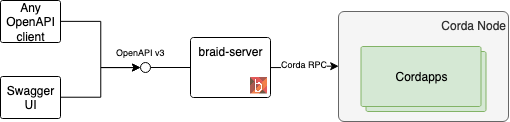
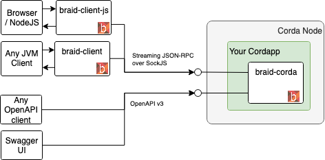
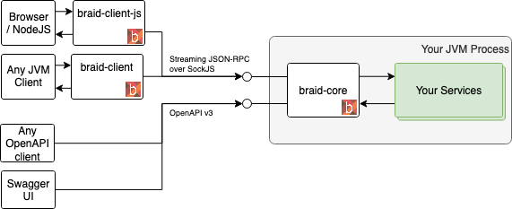

# Braid

[](https://gitlab.com/bluebank/braid/commits/master)

 
 
## Introduction

_Braid is a high performance reactive RPC and REST library for exposing your services in a secure way, with very little code, and to consume them in any language, runtime, and platform._

The library has three primary modules: 
* [braid-server](braid-server/README.md) provides an automatic zero-code proxy server for [Corda RPC](https://docs.corda.net/clientrpc.html).
* [braid-corda](braid-corda/README.md) provides the means for embedding Braid into a [Corda](https://www.corda.net) Cordapp.
* [braid-core](braid-core/README.md) that can be used in any application.

## Modes of Operation

### As a CordaRPC Proxy

Automatically expose an OpenAPI protocol compliant server.
(JSON-RPC streaming coming soon)

    

### Directly within your Corda cordapp

Using both OpenAPI and JSON-RPC protocols.

    

### In your custom server

JSON-RPC protocol available. OpenAPI protocol coming soon.

    

## Comparison to other toolkits

As easy as Spring. As performant as Vertx.
Braid can deliver much higher throughput than all JVM webservers, including popular ones like Spring.
This is owing to its use of the high performance libraries [vertx](https://vertx.io) and [netty](https://netty.io/).
Read the benchmarks [comparison of Vertx to other toolkits](https://www.techempower.com/benchmarks/).
 
## Protocols

Braid implements the [OpenAPI REST](https://swagger.io/docs/specification/about/) (and ships with an in-built Swagger UI) and a [socket-based streaming JSON-RPC protocol](./braid-core/README.md).

## Examples

* [`example-cordapp`](examples/example-cordapp) - an example Corda cordapp, with customised authentication, streaming
* [`example-server`](examples/example-server) - a simple standalone server 
* [another cordapp](https://github.com/joeldudleyr3/pigtail) - another example by [Joel Dudley](https://twitter.com/joeldudley6)

## Building locally

You will need:

* Maven 3.5.x
* Node JS 10.9.x together with NPM 6.2.0
* An up-to-date version of Docker

The build for all modules (Kotlin, Javascript, Cordapps etc) is orchestrated with maven.

To compile, test and install the dependencies:

```bash
mvn clean install
```

The project can be loaded into any IDE that can read Maven POMs.

## Publishing / Deploying Artifacts

1. Create a new tag in Gitlab, following semantic versioning rules.
2. In gitlab CI there is a manual job for the tag that you will kick off
3. Log into [https://oss.sonatype.org/](https://oss.sonatype.org/)
4. Go to the `Staging Repositories` tab, and search for `iobluebank`, locating the current staged release.
5. Close the release and release it.


